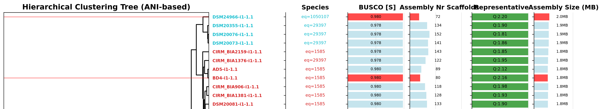

# OrthoFinder CoreSelector: Automated Core Set Selector for OrthoFinder v3

[](https://www.gnu.org/licenses/gpl-3.0)

🎯 **Automated selection of optimal genome core sets for OrthoFinder v3**

## 🚀 Quick Start

```bash
# Install from GitHub
pip install git+https://github.com/MrTomRod/orthofinder-coreselector.git

# Minimal usage (random selection within phylogenetic clusters)
orthofinder-coreselector ani-distance-matrix.csv 150 selected_genomes.txt visualization.svg

# Quality-based usage (with metadata and configuration)
orthofinder-coreselector ani-distance-matrix.csv 150 selected_genomes.txt visualization.svg --metadata-file genomes.tsv --config-file config.json
```

## 📖 Overview

OrthoFinder CoreSelector **selects a subset of genomes from a large collection for [OrthoFinder v3](https://github.com/OrthoFinder/OrthoFinder) analysis.**

[OrthoFinder v3](https://github.com/OrthoFinder/OrthoFinder) introduces a new **core set workflow** (`--core --assign`) that enables scalable analysis of large genome collections. The rationale is to use a representative and diverse subset of genomes for the computationally intensive orthology inference, then assign the remaining genomes to existing orthogroups using the SHOOT algorithm. This dramatically improves scalability while maintaining accuracy.

When you have thousands of genomes, running OrthoFinder on all of them can be computationally expensive and may not provide the best results. OrthoFinder CoreSelector uses a sophisticated three-phase algorithm to select an optimal core set that maximizes both **quality** and **diversity** for this new OrthoFinder v3 workflow.

### 💡 The Solution
OrthoFinder CoreSelector implements an automated algorithm that:
1. **Evaluates genome quality** using multiple metrics (for example: BUSCO, assembly quality, size consistency)
2. **Maximizes phylogenetic diversity** using ANI distance matrices which are turned into a phylogenetic tree
3. **Balances quality and diversity** through weighted scoring
4. **Provides reproducible results** with detailed documentation

## 🔧 Installation

### From GitHub (Recommended)
```bash
pip install git+https://github.com/MrTomRod/orthofinder-coreselector.git
```

### From Source
```bash
git clone https://github.com/MrTomRod/orthofinder-coreselector.git
cd orthofinder-coreselector
pip install -e .
```

## 🖥️ Command Line Interface

OrthoFinder CoreSelector supports two modes of operation:

### Minimal Mode (Phylogenetic Diversity Only)
Uses only a distance matrix for phylogenetic clustering with random selection within clusters.

```bash
orthofinder-coreselector <distance_matrix> <target_core_size> <output_file> <visualization_file>
```

**Example:**
```bash
orthofinder-coreselector ani-distance-matrix.csv 150 selected_genomes.txt visualization.svg
```

### Quality Mode (Metadata-Based Selection)
Uses metadata and configuration for quality-based selection within phylogenetic clusters.

```bash
orthofinder-coreselector <distance_matrix> <target_core_size> <output_file> <visualization_file> --metadata-file <metadata_file> --config-file <config_file>
```

**Example:**
```bash
orthofinder-coreselector ani-distance-matrix.csv 150 selected_genomes.txt visualization.svg --metadata-file genomes.tsv --config-file config.json
```

### Advanced Options
Both modes support additional options:

```bash
orthofinder-coreselector \
    ani-distance-matrix.csv \
    150 \
    selected_genomes.txt \
    visualization.svg \
    --metadata-file genomes.tsv \
    --config-file config.json \
    --log-level DEBUG \
    --max-genomes 200
```

### Help
```bash
orthofinder-coreselector --help
```

## 📁 Input File Formats

### Distance Matrix (CSV) - Required
Square matrix with genome IDs as row/column headers, containing 1-ANI values (0-1).

Such a file can quickly be generated using [GenDisCal](github.com/LM-UGent/GenDisCal), for example:
`GenDisCal --preset approxAni --distancematrix ...`

**Example:**
```csv
,genome1,genome2,genome3
genome1,0.0,0.1,0.2
genome2,0.1,0.0,0.15
genome3,0.2,0.15,0.0
```

### Metadata File (TSV) - Optional (Quality Mode Only)
When using quality mode, the metadata file must contain these columns:
- `Identifier`: Genome ID
- `Representative`: Boolean (True/False) indicating if genome is representative
- `Assembly Size`: Assembly size in base pairs
- `Assembly Nr Scaffolds`: Number of scaffolds/contigs
- `BUSCO [%S]`: BUSCO completeness score (percentage)

**Example:**
```tsv
Identifier      Representative  Assembly Size   Assembly Nr Scaffolds   BUSCO [%S]
4877-i1-1.1     True    2280761 127     None
5b-i1-1.1       True    3019931 91      None
A3-o1-1.1       True    2643746 3       95.4
AD5-i1-1.1      True    1771103 89      98.0
```

## ⚙️ Configuration File - Optional (Quality Mode Only)

When using quality mode, OrthoFinder CoreSelector uses a flexible JSON configuration system that allows you to:
- Define custom column weights for scoring
- Set filtering criteria for any column
- Control visualization settings
- Specify column types and display options

### Configuration File Format (JSON)

```json
{
    "index": "Identifier",
    "columns": {
        "BUSCO [%S]": {
            "weight": 1.0,
            "type": "numeric",
            "normalization": false,
            "direction": "higher_better",
            "filter": {"operator": ">=", "value": 85.0},
            "display_unit": "%",
            "decimal_places": 1
        },
        "Assembly Nr Scaffolds": {
            "weight": 0.5,
            "type": "numeric", 
            "direction": "lower_better",
            "filter": {"operator": "<=", "value": 500},
            "decimal_places": 0
        },
        "Representative": {
            "weight": 1.0,
            "type": "boolean",
            "true_value": true,
            "filter": {"operator": "==", "value": true},
        },
        "Assembly Size": {
            "type": "size_deviation_source",
            "filter": {"operator": "<=", "value": 0.3},
            "display_unit": "MB",
            "scale_factor": 1000000,
            "decimal_places": 1
        }
    }
}
```

### Column Types

- **`numeric`**: Numerical columns with weights and direction preferences
- **`boolean`**: True/false columns with representative bonuses  
- **`size_deviation_source`**: Special type for genome size deviation analysis
- **`text`**: Text columns for grouping and visualization only

### Configuration Options

- **`weight`**: Importance in scoring (required for numeric/boolean types)
- **`normalization`**: Use the values directly, do not calculate z score
- **`direction`**: `"higher_better"` or `"lower_better"` for numeric columns
- **`filter`**: Filtering criteria with operator (`>=`, `<=`, `==`) and value
- **`plot`**: Whether to include in visualization (`true`/`false`)
- **`display_unit`**: Unit for display (e.g., `"%"`, `"MB"`)
- **`scale_factor`**: Factor to scale values for display
- **`decimal_places`**: Number of decimal places to show

## 🧠 Algorithm Details

OrthoFinder CoreSelector operates in two modes with different selection strategies:

### Minimal Mode Algorithm
1. **Distance Matrix Loading**: Loads phylogenetic distance matrix
2. **Hierarchical Clustering**: Creates phylogenetic clusters using UPGMA (average linkage)
3. **Random Selection**: Randomly selects one genome from each cluster
4. **Diversity Maximization**: Ensures selected genomes represent different phylogenetic groups

### Quality Mode Algorithm
When metadata and configuration are provided:

#### Phase 1: Configurable Quality Score Calculation
For each genome, OrthoFinder CoreSelector calculates a comprehensive quality score based on your configuration:

1. **Column Processing**: Each configured column is processed according to its type and settings
2. **Normalization**: Numeric columns are z-score normalized within the dataset
3. **Direction Handling**: Columns marked as `"lower_better"` have their scores inverted
4. **Filtering**: Genomes not meeting filter criteria are excluded from selection
5. **Weighted Combination**: Final score combines all weighted columns: `Score = Σ(weight × normalized_value)`

The flexible configuration allows you to:
- Add any number of quality metrics
- Customize weights for each criterion
- Set filtering thresholds
- Include metadata columns for visualization

#### Phase 2: Quality-Based Phylogenetic Selection
1. **Hierarchical Clustering**: Creates phylogenetic clusters using UPGMA (average linkage)
2. **Quality-Based Selection**: Selects the highest-quality genome from each cluster
3. **Diversity Maximization**: Ensures selected genomes represent different phylogenetic groups while maintaining quality

## 📊 Output

### Selected Genomes
- List of genome IDs (printed to stdout or saved to file)
- Ordered by selection priority

### Visualization (SVG)
**Minimal Mode:** Creates a phylogenetic tree showing selected genomes highlighted in red.

**Quality Mode:** Creates a comprehensive visualization showing:
- **Hierarchical Clustering Tree**: Phylogenetic relationships with selected genomes highlighted
- **Metadata Plots**: Assembly size, contig count, and BUSCO scores
- **Quality Score Annotations**: Final scores for selected genomes


*Example output showing the hierarchical clustering tree with selected genomes highlighted in red, alongside metadata plots for quality assessment.*

## 🤝 Contributing

Contributions are welcome! Please feel free to submit a Pull Request.
